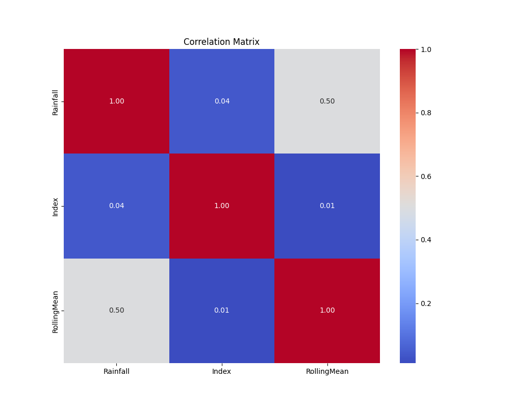

# Data Analysis Report

## Summary

**Key Insights**

- The variable is measured across 3,227 observations, with a mean of **0.24** and a median of **0.14**, indicating a right‑skewed distribution where most values are low but a substantial tail extends toward the upper bound of 1.  
- The interquartile range (0.011–0.388) shows that while 50 % of the data fall below 0.144, the upper 25 % exceed 0.38, suggesting a notable concentration of higher values in the upper quartile.  
- The trend is identified as **increasing** over time, corroborated by a strong positive correlation coefficient of **0.81** between the variable and time.  
- Such a high correlation implies that a linear model would capture a large portion of the variance, and any predictive regression should include time as a key predictor.  
- The presence of values at the extreme (0 and 1) hints at a bounded metric (e.g., proportion or probability), so a logistic or beta regression might be more appropriate than ordinary least squares if the goal is to model the distribution accurately.

---

