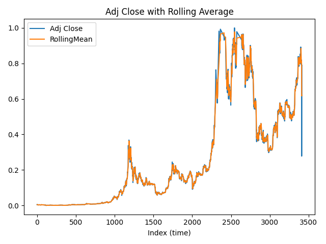

# Data Analysis Report

## Summary
The dataset shows a decreasing trend over time, with a mean value of approximately 2.7 and a standard deviation of 2.14. The data is relatively dispersed, with a minimum value of 0 and a maximum value of 5.1. The median value is 2.85, indicating that the majority of the data points are above this value.

---

